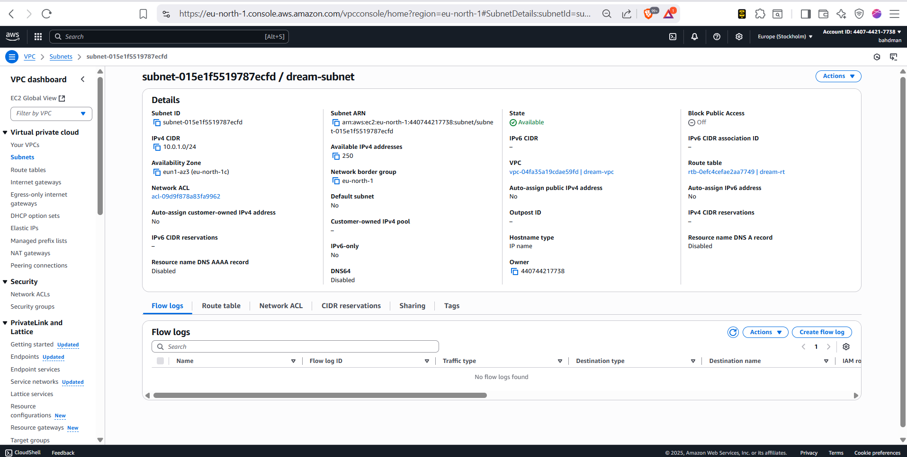
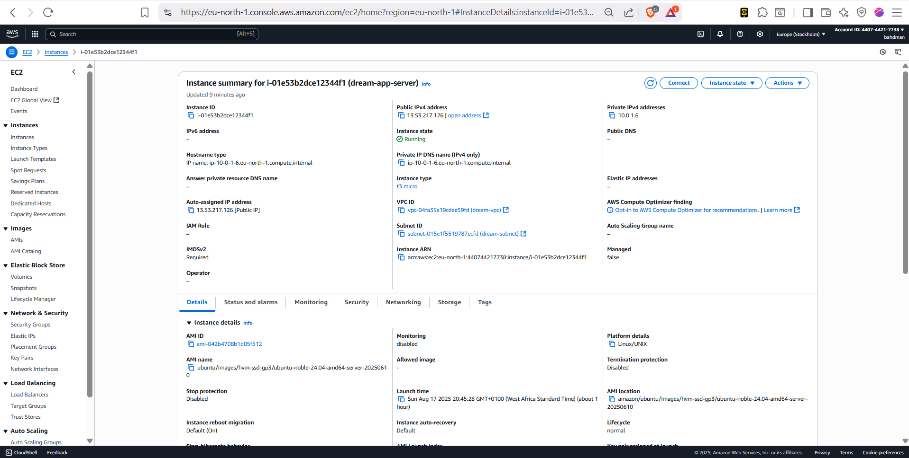
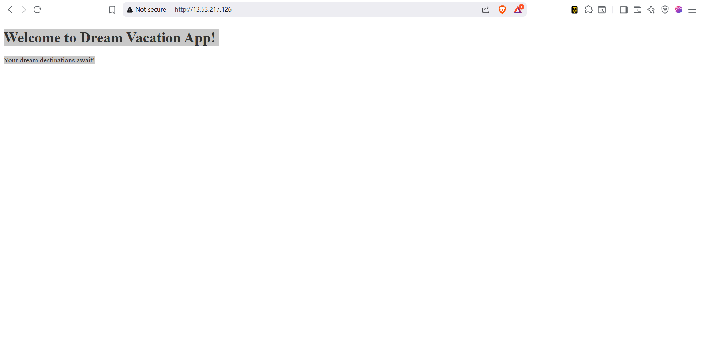
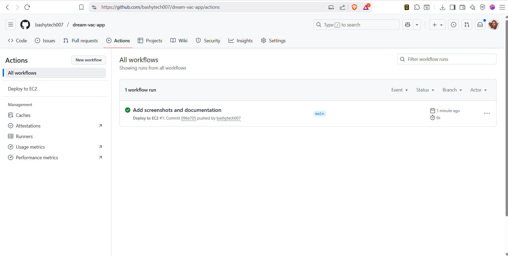

# Dream Vacation App

## Project Overview
This project deploys a Dream Vacation App to EC2 using AWS infrastructure and CI/CD pipeline.

## Infrastructure
- VPC: dream-vpc (10.0.0.0/16)
- Subnet: dream-subnet (10.0.1.0/24)
- Internet Gateway: dream-igw
- Route Table: dream-rt
- EC2 Instance: Ubuntu t3.micro

## Deployment
- Containerized with Docker
- CI/CD pipeline with GitHub Actions
- Successfully deployed and tested

## Screenshots

### VPC and Subnet Configuration

### EC2 Instance Running

### Application Running in Browser

### CI/CD Pipeline Successful Deployment

## Deliverables
- ✅ VPC and subnet configured in AWS Console
- ✅ EC2 instance running screenshot
- ✅ App running in browser
- ✅ CI/CD pipeline implemented